# astra-datastax
 Create astra database, insert records via swagger ui and bulk insert via python

How to create astra database, insert records using swagger ui and bulk insert via python

High level steps

1. goto datastax.com and sign up for astra database

2. create astra database
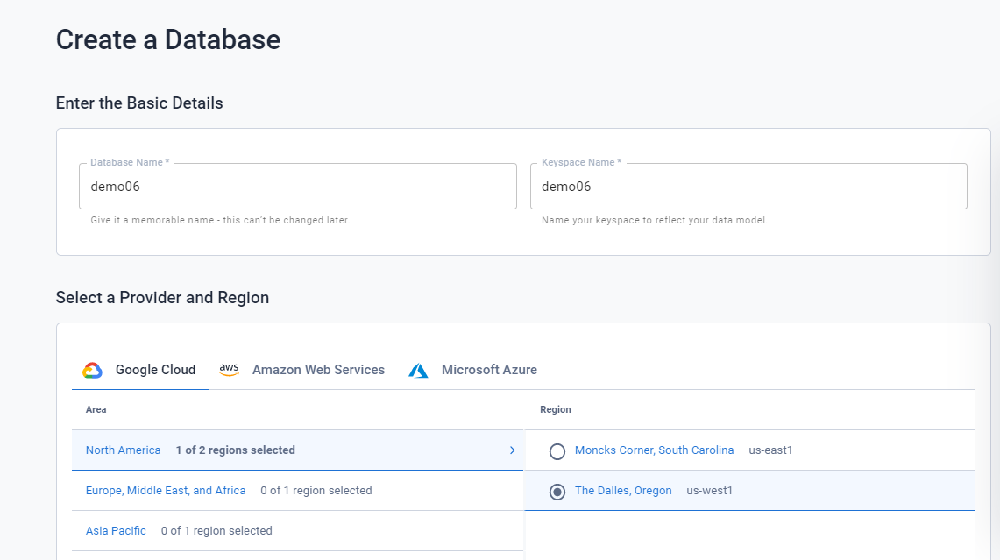

3. Click on the connect
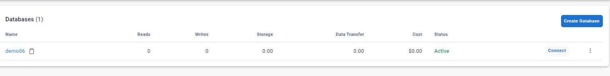

4. Click on the REST API. Create app user and generate the client_id, client_secret and token. Also download
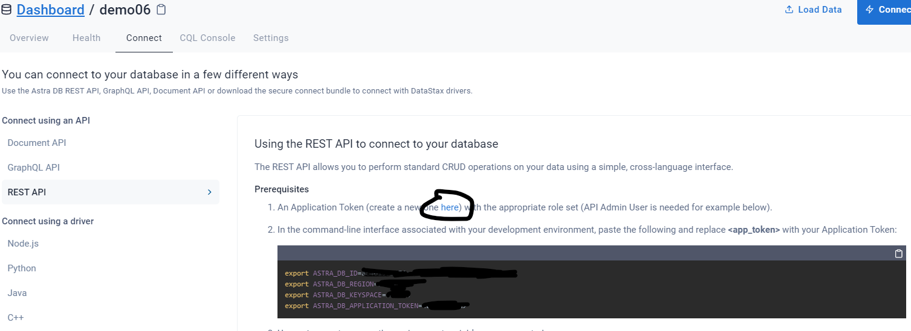

5. Launch swagger link 
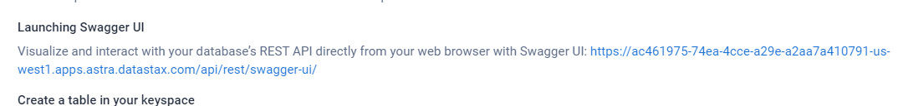

6. Use Swagger UI to create table, post records. To create table click on the schema and look for V2 option to create table

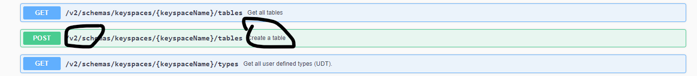

7.Add the App token you generated and keyspace is demo06 that was created as part of the database creation. Then create users table and click on execute
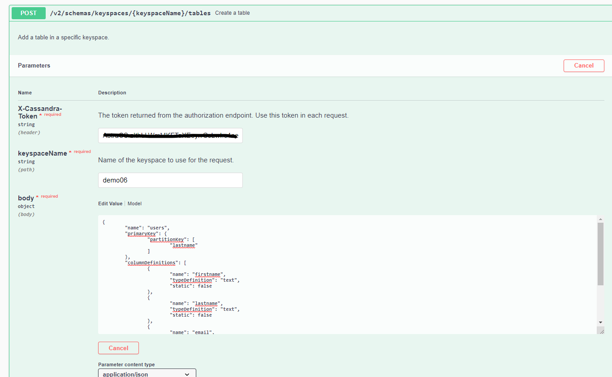

9 CSQL - to check if table was created.
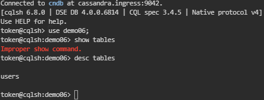

10. Insert records via swagger UI - same above look for v2 option under data 

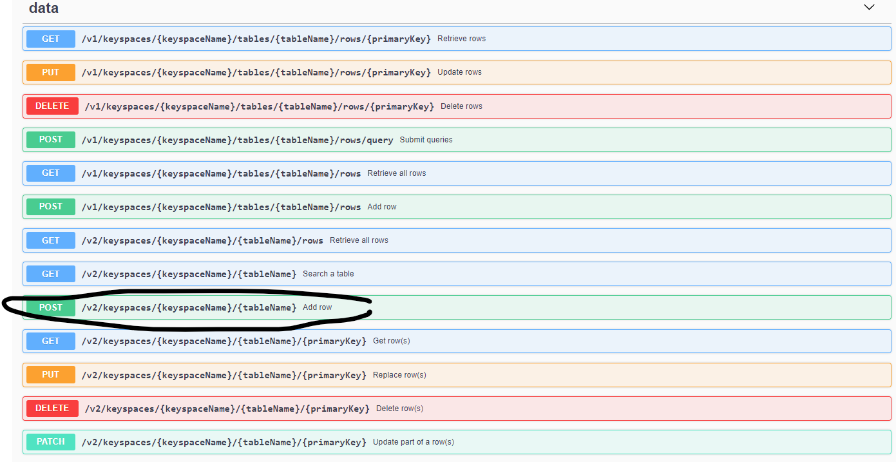

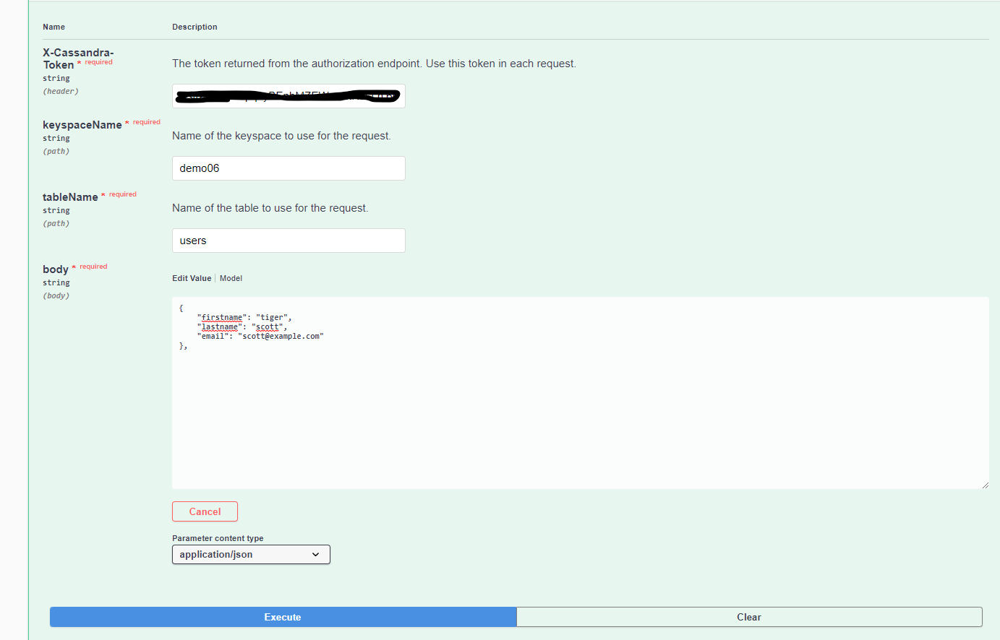

11. Go to dashboard and click python. Now download secure connect bundle under python and connect to database

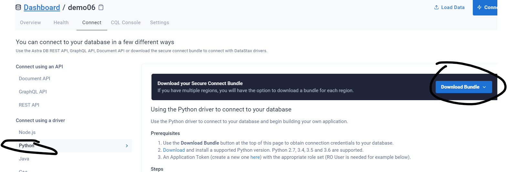

12. run bulkinsert python script for batch insert.
run the script - batchinsert.py 

13. CQL to check the record count.

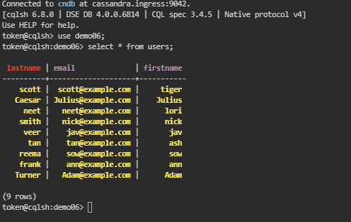
